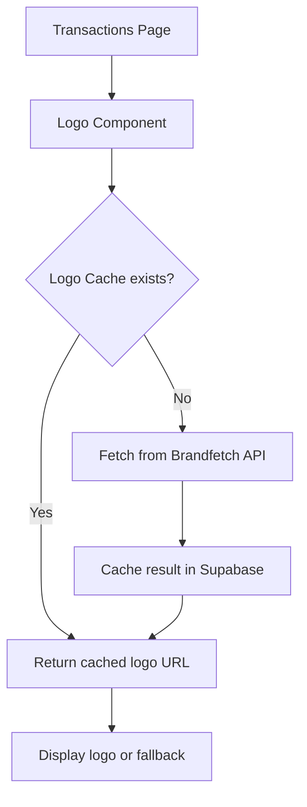

# Brandfetch Logo Integration Plan

## Overview

Add company logos to transaction list items using Brandfetch's Logo API. Each transaction will show a small circular logo next to the description. Unknown companies will show a blank white circle.

## Architecture



## 1. API Integration

### Brandfetch API Details
- **Endpoint**: `https://api.brandfetch.com/v2/brands/{domain or company name}`
- **Authentication**: Bearer token (API key)
- **Response**: Contains logo URLs with different sizes

### Implementation Options

**Option A: Client-side API calls**
- Pros: Simple to implement
- Cons: Exposes API key, rate limiting concerns

**Option B: Supabase Edge Function (Recommended)**
- Pros: Secure API key storage, can implement caching
- Cons: Additional infrastructure

### Recommended Approach: Supabase Edge Function

Create a new Edge Function `get-company-logo` that:
1. Accepts company name as input
2. Calls Brandfetch API with the user's API key
3. Returns logo URL
4. Handles caching logic

## 2. Caching Strategy

### Multi-layer Caching

**Layer 1: In-memory cache (client)**
- Store logo URLs in a React context or local state
- Persist to `localStorage` for session persistence
- TTL: Session duration

**Layer 2: Database cache (Supabase)**
- Create a new table `company_logos`:
  ```sql
  CREATE TABLE company_logos (
    id UUID PRIMARY KEY DEFAULT gen_random_uuid(),
    user_id UUID REFERENCES auth.users(id),
    company_name TEXT NOT NULL,
    logo_url TEXT,
    domain TEXT,
    created_at TIMESTAMPTZ DEFAULT NOW(),
    updated_at TIMESTAMPTZ DEFAULT NOW(),
    UNIQUE(user_id, company_name)
  );
  ```
- Cache hit avoids API call entirely
- Periodic refresh (e.g., 30 days) to handle rebrands

### Cache Key Strategy
- Primary key: `company_name` (normalized lowercase)
- Handle variations: "Sanitas", "SANITAS", "sanitas" → same cache entry

## 3. Database Changes

### New Table: `company_logos`

```sql
-- Run in Supabase SQL Editor
CREATE TABLE company_logos (
  id UUID PRIMARY KEY DEFAULT gen_random_uuid(),
  user_id UUID NOT NULL REFERENCES auth.users(id) ON DELETE CASCADE,
  company_name TEXT NOT NULL,
  logo_url TEXT,
  domain TEXT,
  last_fetched TIMESTAMPTZ,
  created_at TIMESTAMPTZ DEFAULT NOW(),
  updated_at TIMESTAMPTZ DEFAULT NOW(),
  UNIQUE(user_id, company_name)
);

-- Enable RLS
ALTER TABLE company_logos ENABLE ROW LEVEL SECURITY;

-- Policies
CREATE POLICY "Users can view their own logo cache"
  ON company_logos FOR SELECT
  USING (auth.uid() = user_id);

CREATE POLICY "Users can insert their own logo cache"
  ON company_logos FOR INSERT
  WITH CHECK (auth.uid() = user_id);

CREATE POLICY "Users can update their own logo cache"
  ON company_logos FOR UPDATE
  USING (auth.uid() = user_id);
```

## 4. UI Design

### Logo Component

```tsx
interface CompanyLogoProps {
  companyName: string;
  size?: 'sm' | 'md' | 'lg';
}

function CompanyLogo({ companyName, size = 'sm' }: CompanyLogoProps) {
  const sizeClasses = {
    sm: 'w-8 h-8',
    md: 'w-12 h-12',
    lg: 'w-16 h-16',
  };

  return (
    <div className={`${sizeClasses[size]} rounded-full bg-white border border-neutral-200 flex items-center justify-center overflow-hidden flex-shrink-0`}>
      {/* Logo image or fallback */}
    </div>
  );
}
```

### Placement in Transaction List

```mermaid
┌─────────────────────────────────────────────────────────────────┐
│ Date  │  ○  Description          │ Property │ Category │ Amount │
├─────────────────────────────────────────────────────────────────┤
│ Jan 6 │  ○  Sanitas              │ Prop A   │ Health   │ €150   │
│ Jan 5 │  ○  Iberdrola            │ Prop B   │ Utilities│ €89    │
│ Jan 4 │  ○  [blank circle]       │ Prop A   │ Food     │ €45    │
└─────────────────────────────────────────────────────────────────┘
```

### Visual Specs
- Size: 32x32px (sm) or 40x40px (md)
- Shape: Circular
- Background: White
- Border: 1px neutral-200
- Object-fit: contain
- Fallback: White circle with no content

## 5. Implementation Steps

### Phase 1: Backend Setup
1. Create Supabase Edge Function `get-company-logo`
2. Add Brandfetch API key to Edge Function environment
3. Implement caching logic in Edge Function
4. Create `company_logos` database table

### Phase 2: Logo Service
1. Create `src/lib/logoService.ts`:
   - `getLogo(companyName: string): Promise<string | null>`
   - `cacheLogo(companyName: string, logoUrl: string): Promise<void>`
   - `normalizeCompanyName(name: string): string`

### Phase 3: React Components
1. Create `src/components/CompanyLogo.tsx`
2. Add logo state management to Transactions page
3. Integrate logo component into transaction row

### Phase 4: Optimization
1. Implement lazy loading for logos
2. Add loading skeletons
3. Handle API errors gracefully
4. Add retry logic

## 6. API Usage & Rate Limits

Brandfetch Pricing Considerations:
- Check user's plan for rate limits
- Implement exponential backoff for retries
- Consider caching more aggressively for free tier

## 7. Error Handling

| Scenario | Behavior |
|----------|----------|
| API error | Return cached logo if available, else fallback |
| Company not found | Store null in cache to avoid repeated lookups |
| Rate limited | Use cached logo, queue retry |
| Network error | Return cached logo, retry on next render |

## 8. Configuration

Add to `.env`:
```env
BRANDFETCH_API_KEY=your_api_key_here
```

Or store in Supabase secrets for Edge Function:
```bash
supabase secrets set BRANDFETCH_API_KEY=your_api_key
```

## Files to Create/Modify

### New Files
- `supabase/functions/get-company-logo/index.ts`
- `src/lib/logoService.ts`
- `src/components/CompanyLogo.tsx`

### Modified Files
- `code/propledger/src/pages/Transactions.tsx` - Integrate logo component
- `supabase/migrations/` - Add company_logos table

## Estimated Complexity

- **Backend**: Moderate (Edge Function with caching)
- **Frontend**: Low (UI component + state)
- **Database**: Low (Single table)
- **Dependencies**: None (uses existing fetch API)

## Questions for Clarification

1. Should logos be shown in the transaction modal as well? yes
2. Preferred logo size (32px vs 40px)? 32px
3. Should users be able to manually override/remove logos? no
4. Any preference on fallback icon for unknown companies? white / blank circle
