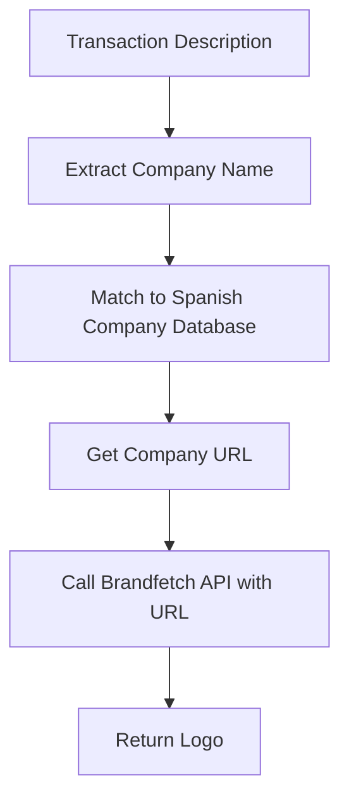

# Spanish Company Logo Matching Plan

## Overview

Implement URL-based logo matching for Spanish company transactions using Brandfetch API. Instead of searching by company name, we'll extract/guess the company URL from transaction descriptions and use Brandfetch's domain lookup to get logos.

## Problem Statement

Transaction descriptions from Spanish banks often contain:
- Partial company names: "SANITAS S A" → sanitas.es
- Abbreviated names: "CASER RESID." → caseresidencial.es
- Truncated names: "NATURGY*" → naturgy.com
- Various suffixes: S.A., S.L., GmbH, etc.

## Architecture



## Implementation Strategy

### 1. Spanish Company Database

Create a comprehensive mapping of Spanish company names to their websites:

```typescript
const spanishCompanies: Record<string, string> = {
  // Health Insurance
  'sanitas': 'sanitas.es',
  'asisa': 'asisa.es',
  'adeslas': 'adeslas.es',
  'dkv': 'dkv.es',
  'mapfre': 'mapfre.es',
  'axa': 'axa.es',
  'allianz': 'allianz.es',
  'generali': 'generali.es',
  'hna': 'hna.es',
  'caconsalud': 'caconsalud.es',
  'caser': 'ccaseresidencial.es',
  'quironsalud': 'quironsalud.es',
  'imq': 'imq.es',
  'antares': 'antares.es',
  'nueva': 'nueva-mutua.es',
  'muface': 'muface.gob.es',
  'mugeju': 'mugeju.es',
  'isme': 'isme.es',
  
  // Electricity & Gas
  'iberdrola': 'iberdrola.es',
  'endesa': 'endesa.es',
  'naturgy': 'naturgy.com',
  'repsol': 'repsol.com',
  'ceca': 'ceca.es',
  'energia': null, // Generic - skip
  'gas': null, // Generic - skip
  
  // Telecommunications
  'telefonica': 'telefonica.com',
  'movistar': 'movistar.es',
  'vodafone': 'vodafone.es',
  'orange': 'orange.es',
  'masmovil': 'masmovil.es',
  'yoigo': 'yoigo.com',
  'pepephone': 'pepephone.com',
  'lowi': 'lowi.es',
  
  // Banking
  'bbva': 'bbva.es',
  'santander': 'santander.es',
  'caixabank': 'caixabank.es',
  'sabadell': 'sabadell.es',
  'bankia': 'bankia.es',
  'kutxabank': 'kutxabank.es',
  'unicaja': 'unicaja.es',
  'bankinter': 'bankinter.es',
  ' OPENBANK': 'openbank.es',
  'ing': 'ing.es',
  
  // Water
  'aqua': null, // Check local
  'hidrogea': 'hidrogea.es',
  'canaragua': 'canaragua.es',
  'agbar': 'agbar.es',
  
  // Internet/Tv
  'netflix': 'netflix.com',
  'amazon': 'amazon.es',
  'spotify': 'spotify.com',
  'disney': 'disneyplus.com',
  'hbo': 'hbo.com',
  'youtube': 'youtube.com',
  'adobe': 'adobe.com',
  
  // Property Management
  'colonial': 'colonial.es',
  'merlin': 'merlinproperties.es',
  'testa': 'testahomes.com',
  'sareb': 'sareb.es',
  
  // Insurance - Home/Car
  'linea': 'lineadirecta.es',
  'direct': 'directline.es',
  'verti': 'verti.es',
  'tallamigo': 'tallamigo.es',
  'balumba': 'balumba.es',
  'allianz': 'allianz.es',
  'zurich': 'zurich.es',
  'pelayo': 'pelayo.com',
  'mutua': 'mutua.es',
  
  // Waste/Recycling
  'valdemingomez': 'valdemingomez.com',
  'fcc': 'fcc.es',
  'urbaser': 'urbaser.es',
  'conalvial': 'conalvial.es',
  
  // Community/Building
  'comunidad': null, // Skip - too generic
  'comunidadde': null, // Skip
  'gastos': null, // Skip
  'cargafamiliar': null, // Skip
  
  // Others Common
  'edreams': 'edreams.es',
  'booking': 'booking.com',
  'airbnb': 'airbnb.es',
  'uber': 'uber.com',
  'cabify': 'cabify.com',
  'glovo': 'glovoapp.com',
  'deliveroo': 'deliveroo.es',
  'just': 'just-eat.es',
  'pizza': null, // Check
  'burger': null, // Check
  'mc Donald': 'mcdonalds.es',
  'dominos': 'dominos.es',
  'subway': 'subway.com',
  'carrefour': 'carrefour.es',
  'mercadona': 'mercadona.es',
  'lidl': 'lidl.es',
  'aldi': 'aldi.es',
  'eroski': 'eroski.es',
  'elcorteingles': 'elcorteingles.es',
  'amazon': 'amazon.es',
  'mediamarkt': 'mediamarkt.es',
  'fnac': 'fnac.es',
  'decathlon': 'decathlon.es',
  'zara': 'zara.com',
  'massimo': 'massimodutti.com',
  'pull': 'pullandbear.com',
  'bershka': 'bershka.com',
  'stradivarius': 'stradivarius.com',
  'oysho': 'oysho.com',
  'ueterra': 'ueterra.es',
  
  // Schools/Universities
  'colegio': null, // Check local
  'escuela': null, // Check local
  'universidad': null, // Check local
  'ie': 'ie.edu',
  'iese': 'iese.edu',
  'esade': 'esade.edu',
  'deusto': 'deusto.es',
  'navarra': 'unav.es',
  'pontificia': 'pontificia.edu.es',
  
  // Medical
  'hospital': null, // Check local
  'clinica': null, // Check local
  'centro': null, // Check local
  'quironsalud': 'quironsalud.es',
  'hmo': 'hmohospitales.es',
  'hospiten': 'hospiten.com',
  'vithas': 'vithas.es',
  'rubio': 'rubio.es',
  
  // Parking
  'aparcamiento': null, // Check local
  'parking': null, // Check local
  'saba': 'saba.eu',
  'emo': 'emo.es',
  'carly': 'carly.es',
};
```

### 2. Company Name Extraction

Process transaction descriptions to extract company identifiers:

```typescript
function extractCompanyName(description: string): string {
  // Remove common prefixes/suffixes
  let cleaned = description
    .replace(/^\d+\s*/, '') // Remove leading numbers
    .replace(/\*\s*$/, '') // Remove trailing *
    .replace(/\s+S\.?A\.?\s*$/i, '') // Remove S.A.
    .replace(/\s+S\.?L\.?\s*$/i, '') // Remove S.L.
    .replace(/\s+GmbH\s*$/i, '') // Remove GmbH
    .replace(/\s+Inc\.?\s*$/i, '') // Remove Inc.
    .replace(/\s+Ltd\.?\s*$/i, '') // Remove Ltd.
    .trim();
  
  // Get first significant word(s)
  const words = cleaned.split(/\s+/);
  if (words.length > 0) {
    return words[0].toLowerCase();
  }
  
  return cleaned.toLowerCase();
}
```

### 3. URL Matching Logic

```typescript
async function getLogoForTransaction(description: string): Promise<string | null> {
  const companyName = extractCompanyName(description);
  
  // Check if it's a known company
  const url = spanishCompanies[companyName];
  
  if (!url) {
    // Try to extract domain from description
    const extractedUrl = extractDomainFromDescription(description);
    if (extractedUrl) {
      return fetchLogoFromBrandfetch(extractedUrl);
    }
    return null; // No match found
  }
  
  if (url === null) {
    return null; // Known but no URL (skip)
  }
  
  return fetchLogoFromBrandfetch(url);
}
```

### 4. Brandfetch API with URL

Brandfetch supports domain lookup directly:

```typescript
async function fetchLogoFromBrandfetch(domain: string): Promise<string | null> {
  // Domain format: sanitas.es or www.sanitas.es
  const cleanDomain = domain.replace(/^https?:\/\//, '').replace(/^www\./, '');
  
  const response = await fetch(`https://api.brandfetch.com/v2/brands/${encodeURIComponent(cleanDomain)}`, {
    headers: {
      'Authorization': `Bearer ${BRANDFETCH_API_KEY}`,
    },
  });
  
  if (!response.ok) return null;
  
  const data = await response.json();
  
  if (data.logos && data.logos.length > 0) {
    const logo = data.logos.find((l: any) => l.format === 'svg') 
      || data.logos.find((l: any) => l.format === 'png')
      || data.logos[0];
    
    return logo?.url || null;
  }
  
  return null;
}
```

### 5. Caching Strategy

Same as before but with URL as part of the cache key:

```sql
-- Add domain column to cache
CREATE TABLE company_logos (
  id UUID PRIMARY KEY DEFAULT gen_random_uuid(),
  user_id UUID REFERENCES auth.users(id),
  company_name TEXT NOT NULL,
  domain TEXT, -- New: store the domain used
  logo_url TEXT,
  last_fetched TIMESTAMPTZ,
  UNIQUE(user_id, company_name)
);
```

### 6. Implementation Files

| File | Changes |
|------|---------|
| `src/lib/logoService.ts` | Update to use URL-based matching |
| `src/lib/spanishCompanies.ts` | New: Spanish company database |
| `supabase/functions/get-company-logo/index.ts` | Update matching logic |
| `supabase/migrations/` | Add domain column |

### 7. Example Mappings

| Transaction Description | Extracted Name | URL | Logo |
|------------------------|----------------|-----|------|
| SANITAS S A | sanitas | sanitas.es | ✅ |
| CASER RESID. | caser | caser.es | ✅ |
| NATURGY* | naturgy | naturgy.com | ✅ |
| IBERDROLA DISTRIBUCION | iberdrola | iberdrola.es | ✅ |
| ENDESA ENERGIA SA | endesa | endesa.es | ✅ |
| BBVA SA | bbva | bbva.es | ✅ |
| CAFETERIA LA PLAZA | cafeteria | null | ❌ |

## Next Steps

1. Create `spanishCompanies.ts` with comprehensive mappings
2. Update `logoService.ts` with URL extraction logic
3. Update Edge Function for URL-based lookups
4. Add domain column to database
5. Test with real transactions
